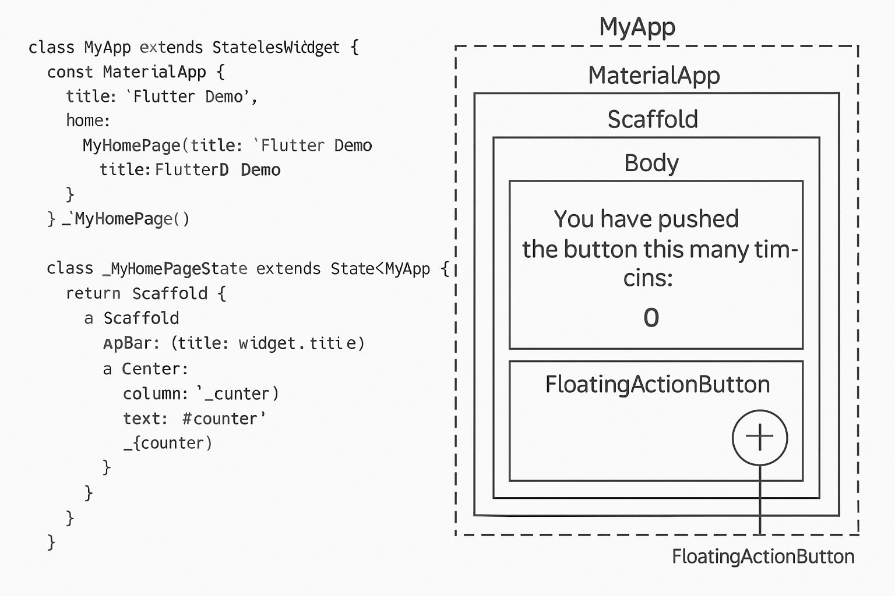

# [개념명] Flutter 기본 앱 구조 - main.dart 분석 및 시각화

## 1. 개요
Flutter의 기본 앱 템플릿(`main.dart`)에 포함된 코드의 역할을  
세부 주석과 함께 설명하고, UI 구조를 시각화하여 전체 앱 동작 흐름을 이해하기 쉽게 정리한 문서.

---

## 2. 주요 코드 설명 (`main.dart`)

```dart
import 'package:flutter/material.dart'; // Flutter Material Design 위젯 사용

void main() {
  runApp(const MyApp()); // 최상위(root) 위젯으로 MyApp 실행
}

class MyApp extends StatelessWidget {
  const MyApp({Key? key}) : super(key: key);

  @override
  Widget build(BuildContext context) {
    return MaterialApp(
      title: 'Flutter Demo', // 앱 타이틀 (일부 플랫폼에서 사용됨)
      theme: ThemeData(primarySwatch: Colors.blue), // 앱 테마 색상 설정
      home: const MyHomePage(title: 'Flutter Demo Home Page'), // 첫 화면 지정
    );
  }
}

class MyHomePage extends StatefulWidget {
  const MyHomePage({Key? key, required this.title}) : super(key: key);
  final String title; // 앱바에 표시할 텍스트

  @override
  State<MyHomePage> createState() => _MyHomePageState();
}

class _MyHomePageState extends State<MyHomePage> {
  int _counter = 0; // 카운터 상태 변수

  void _incrementCounter() {
    setState(() {
      _counter++; // 버튼 누를 때마다 값 증가
    });
  }

  @override
  Widget build(BuildContext context) {
    return Scaffold(
      appBar: AppBar(title: Text(widget.title)), // 상단 앱바
      body: Center(
        child: Column(
          mainAxisAlignment: MainAxisAlignment.center, // 세로 중앙 정렬
          children: <Widget>[
            const Text('You have pushed the button this many times:'),
            Text(
              '$_counter', // 현재 카운트 표시
              style: Theme.of(context).textTheme.headline4,
            ),
          ],
        ),
      ),
      floatingActionButton: FloatingActionButton(
        onPressed: _incrementCounter, // 버튼 눌렀을 때 실행
        tooltip: 'Increment',
        child: const Icon(Icons.add),
      ),
    );
  }
}
```

---

## 3. 시각화: 위젯 구조 다이어그램

아래는 앱이 실행되었을 때 위젯이 어떻게 구성되는지를 시각적으로 표현한 다이어그램이다.



> `Scaffold`를 중심으로 `AppBar`, `Center`, `Column`, `Text`, `FloatingActionButton`이 어떻게 배치되어 있는지를 한눈에 파악 가능함.

---

## 4. 요약

- `MaterialApp`: 앱 전체 설정 및 네비게이션 루트
- `Scaffold`: 앱 기본 레이아웃 구조 제공 (AppBar, Body, FAB 포함)
- `StatefulWidget`: 상태 변경에 따라 UI 갱신
- `setState()`: 상태 변경을 트리거하여 `build()` 재실행
- `FloatingActionButton`: UI 상에서 실시간 상호작용을 유도하는 핵심 위젯

---

## 5. 활용 팁

- Flutter 앱 구조를 처음 접할 때 `main.dart`를 분석하는 것이 핵심
- 다이어그램을 통해 위젯 계층을 시각화하면 유지보수와 커스터마이징이 쉬워짐
