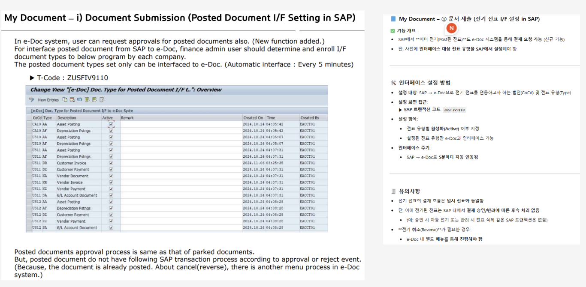

# [개념명] Posted 전표 처리 방식의 비교 - 결재요청, 전기취소, 역분개

## 1. 개요

SAP에 이미 기표(Post)된 전표에 대해 전자결재 시스템(e-Doc)에서 수행 가능한 **결재요청**, **전기취소(Cancel)**, **역분개(Reverse)** 개념을 비교 정리한다.

---

## 2. 주요 용어 정의

| 용어 | 정의 |
|------|------|
| **Posted 전표** | SAP 총계정원장(G/L)에 기표 완료되어 회계에 반영된 전표 |
| **결재요청 (e-Doc)** | Posted 전표에 대해 e-Doc 내부 결재 프로세스를 요청하는 기능 (SAP 영향 없음) |
| **전기취소 (Cancel)** | SAP 트랜잭션 코드(`FB08`) 등을 사용해 기존 전표를 취소 처리 (취소 전표 생성) |
| **역분개 (Reverse)** | 동일한 금액을 반대 방향으로 입력하여 기존 전표의 영향을 상쇄 (회계상 무효화) |

---

## 3. 처리 방식 비교

| 구분 | 결재요청 | 전기취소 (Cancel) | 역분개 (Reverse) |
|------|------------|-------------------|------------------|
| 처리 위치 | e-Doc | SAP | SAP 또는 e-Doc 연동 |
| SAP에 영향 | ❌ 없음 | ⭕ 전표 취소 반영 | ⭕ 반대 전표 반영 |
| 전표 상태 | 유지됨 | 취소됨 | 상쇄됨 (존재는 유지) |
| 사용 목적 | 내부 통제, 승인 이력 | 입력 실수 등 무효화 | 회계상 정정, 반대 처리 |
| SAP 기능 예시 | 없음 | `FB08` | `FB08`, `FBRA`, `F.80` 등 |
| e-Doc 내 메뉴 | “결재 요청” | 별도 메뉴에서 처리 | 별도 메뉴에서 처리 |

---

## 4. 사용자 매뉴얼 기준 설명 요약

> **출처**: [글로비스 북미 전자결재(eDoc) 시스템 사용자 매뉴얼.pdf]  
> **위치**: `My Document – i) Document Submission (Posted Document I/F Setting in SAP)`  
> **내용 요약**:  
> - Posted 전표도 e-Doc에서 결재 요청 가능 (신규 기능)  
> - 단, SAP에는 승인/반려로 인한 처리 없음  
> - 전기취소/역분개는 SAP 트랜잭션으로 처리해야 하며, e-Doc에서는 **별도 메뉴** 제공

📌 관련 화면 예시:  

## 5. 설계 시 고려사항

- Posted 전표에 대한 결재 요청은 단순 승인 이력 기록용
- SAP에 실제 영향을 주는 기능은 전기취소 / 역분개 → SAP RFC 연동 필수
- e-Doc 시스템 내 역분개 요청은 SAP와 실시간 또는 배치로 인터페이스 필요
- 결재선, 역할, 대상 전표유형 등 설정은 SAP ↔ e-Doc 간 매핑 필요

---

## 6. 활용 예시 시나리오

### ✅ 내부 통제용 승인
> 이미 전기된 전표지만, 내부 감사/규정상 승인을 받고 싶을 때 e-Doc에서 결재 요청

### ✅ 금액 오류로 인한 무효 처리
> SAP에서 전기취소 수행 후, e-Doc에서 취소 전표 확인 및 증빙 첨부

### ✅ 반품, 환입 등의 회계 정정
> 역분개 전표 요청 → e-Doc 결재 → SAP 자동 반대 전표 생성

