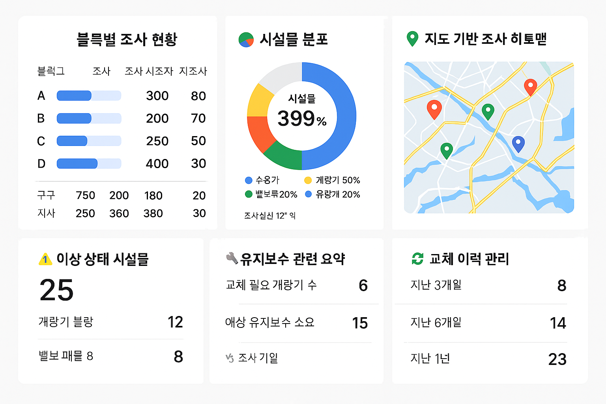

# 상수도시설물통합관리시스템_대시보드

##  대시보드 시각 예시

> 아래 이미지는 시스템 관리자용 대시보드 구성 예시입니다.  
> 6개의 핵심 콘텐츠가 시각적으로 한 화면에 통합되어 구성되어 있습니다.

![[images/images_01_02.png]]
▲ 상수도시설물 통합관리 대시보드 구성 이미지

## 1. 📊 블록별 시설물 현황

### 세부 항목
- 블록 리스트 (대블록 / 중블록 / 소블록 구분)
- 각 블록 내 등록된 시설물 수 (계량기, 수용가, 밸브 등)
- 유형별 시설물 분포 현황 (막대그래프 또는 도넛 차트)
- 조사 상태별 진행률 (완료 / 미조사 / 재조사)
- 이상 상태 시설물 수 (불량, 매몰, 고장 등)
- 유지보수 대상 수 (교체 예정 포함)

### 목적과 활용성
- **블록 단위로 시설물의 등록현황과 조사진행률을 동시에 파악**
- **시설물 밀집지역, 미조사 블록, 유지보수 우선대상 블록을 시각적으로 확인 가능**
- **단순 조사율 → 실질적 관리가 필요한 영역까지 연결해주는 확장형 콘텐츠**
- 시설물 등록 누락, 조사 누락, 보수 누락 등을 한 화면에서 종합 점검 가능

### 요약
- ✅ 시설물 분포 + 조사 상태 + 유지보수까지 통합 관리  
- ✅ 블록 단위 리포트 / 인력 배치 / 우선 관리지역 식별  
- ✅ 고도화된 공간 기반 시설물 데이터 시각화 가능

---

## 3. 🌍 지도기반 조사 히트맵

### 세부 항목
- 지도상에 조사 상태별 색상(예: 초록=완료, 빨강=미조사)
- 블록/지역별 마커 표시
- 조사 완료/미완료 건수 간략 팝업 or 요약

### 목적과 활용성
- **지리 기반 누락 구간을 직관적으로 시각화**
- “조사완료된 것처럼 착각”하는 데이터 누락 방지
- 조사구역 재설계 / 현장 워커 배치 재조정 가능
- 지역 겹침, 중복 등록, 경계 오류 파악에도 유리

### 요약
- ✅ 미조사/재조사 지역 즉시 시각화  
- ✅ 현장 조사 누락 방지  
- ✅ 조사구역 경계 재검토 활용

---

## 4. ⚠️ 이상 상태 시설물 요약

### 세부 항목
- 이상 상태 건수(불량, 매몰, 봉인 손상 등) 유형별 정리
- 이상 발생률(%), 최근 발생 추이
- 우선 조치가 필요한 심각도 등급별 구분 가능

### 목적과 활용성
- **즉시 점검 또는 유지보수 대상 시설물 선별**
- 관리자나 유지보수팀이 빠르게 현장 조치 가능
- 이상 발생 빈도 파악 → 원인 분석 및 재발 방지 대책 마련
- 예산 투입 우선순위 근거 제공

### 요약
- ✅ 우선 조치 대상 식별  
- ✅ 이상 발생 유형 통계 분석  
- ✅ 관리자/보수팀 현장 알림 기능

---

## 5. 🔧 유지보수 관련 요약

### 세부 항목
- 교체 필요 수량 (내구연한 도래, 파손 등)
- 월별 유지보수 대상 수량 추이
- 예상 필요 예산 (선택 항목)
- 긴급 유지보수 필요 여부 플래그 표시

### 목적과 활용성
- **예방적 유지보수 전략 수립 가능**
- 교체 스케줄링, 발주 계획 수립에 효과적
- 유지보수팀 인력/장비 배치 최적화
- 연간/월간 보고서 작성 시 기초자료로 활용

### 요약
- ✅ 내구연한 기반 교체 대상 예측  
- ✅ 예산/인력/자재 계획 수립  
- ✅ 유지보수 사전 준비

---

## 6. 🔁 교체 이력 관리

### 세부 항목
- 교체된 시설물 수 (일자별/유형별)
- 교체 전/후 비교 정보 (예: 계량기 형식, 위치 등)
- 교체 사유 통계 (내구연한, 파손, 미확인 등)
- 사진 기반 이력 첨부 여부

### 목적과 활용성
- **교체 내역을 기반으로 품질관리 및 감사자료 확보**
- 동일 사유 반복 발생 여부 모니터링
- 불량 자재 문제 추적에 도움
- 시설물 데이터 신뢰성 확보 (특히 공공기관 보고 시)

### 요약
- ✅ 교체 사유 및 위치 정보 정리  
- ✅ 감사자료 및 품질관리 대응  
- ✅ 문제 자재 추적 가능
---

## ✅ 결론: 대시보드의 핵심 역할

- **공간적 + 유형별 + 상태 중심**으로 시설물 관리 상황을 통합 시각화
- 관리자 입장에서 “어디를 먼저 조치해야 할까?”라는 질문에 대한 답 제공
- 조사/보수/보고서/예산계획의 연결고리를 하나의 화면에서 통합 인지 가능

---

